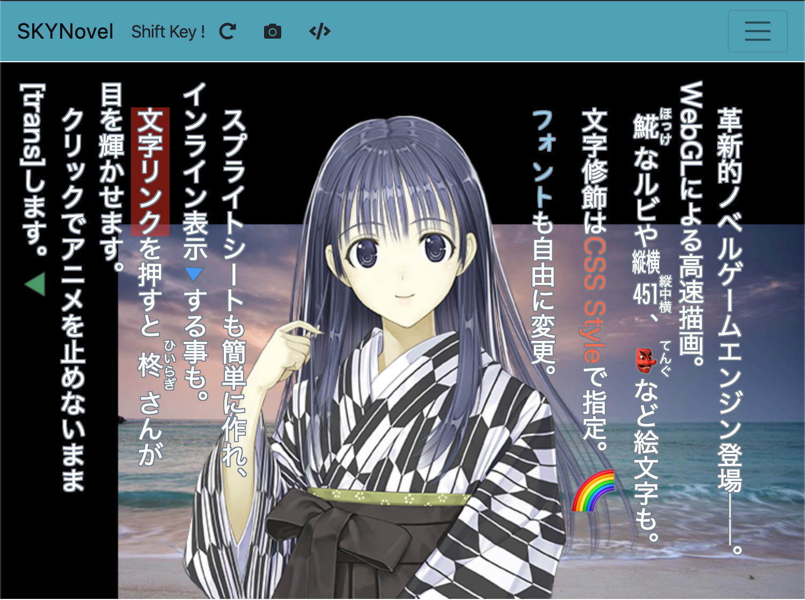

# What can SKYNovel do? 'sample gallery' project

[CHANGELOG.md](CHANGELOG.md)

---
## description（説明）

SKYNovelにはどんな事ができるのか？　というサンプルをまとめたプロジェクトです。
- [ブラウザから直接動かせるサンプル](https://famibee.github.io/SKYNovel_gallery/)があります。

## usage（使用法）

### インストールと環境設定
1. [Node.js と npm](https://nodejs.org/en/)（必ずLTSを）をインストールしておく。
	* 一度マシンを再起動してください。npmへのパスが通ります。
	* （windowsのみ）管理者権限で PowerShell を起動し、【npm i -g windows-build-tools】を実行。「All done!」まで待つ。
2. このページ右上の緑ボタン「Clone or download」をクリック。「Download ZIP」をクリック。
3. ダウンロードしたzipを解凍すると、プロジェクト入りのフォルダになる。
4. [Visual Studio Code](https://code.visualstudio.com/)でこの「フォルダを開く」。
	* [Visual Studio Code [vsCode] 日本語化](https://qiita.com/ntkgcj/items/e77331932c7983dea830)
	* 面倒なら、コマンドライン（Windows）やターミナル（Mac）でも良いです。
5. メニューの【ターミナル】-【新しいターミナル】で下部にターミナルが開く。
6. ターミナルで「npm i」、Enter。
	* （webフォルダができれば成功です）

### 普段の開発（PCアプリ版）
1. メニューの【ターミナル】-【タスクの実行】で「npm: start」を選択。
	* 「今後このタスクの出力をスキャンしない」を選択。（以後は聞かれなくなる）
2. サンプルアプリが起動します。

### 普段の開発（ブラウザ版、PCアプリ版を作りたい人も手軽な開発手段として推奨）
1. メニューの【ターミナル】-【タスクの実行】で「npm: web」を選択。
	* 「今後このタスクの出力をスキャンしない」を選択。（以後は聞かれなくなる）
2. 自動でブラウザを開き、ブラウザ版が起動します。

### タスクの説明
- npm start ... Electronでアプリとして起動します。
- npm plg:w ... ローカルサーバーを起動し、ブラウザ版を起動できます。（プラグインビルド込み）
- npm web ... ローカルサーバーを起動し、ブラウザ版を起動できます。

---
## 拡張機能 / Extension
 - [SKYNovel - Visual Studio Marketplace](https://marketplace.visualstudio.com/items?itemName=famibee.skynovel)

## License ... [MIT](LICENSE)

## Famibee is ?
- [WebSite : 電子演劇部](https://famibee.blog.fc2.com/)
- [Github](https://github.com/famibee/SKYNovel)
- [npm](https://www.npmjs.com/package/skynovel)
- Twitter ([famibee](https://twitter.com/famibee))
